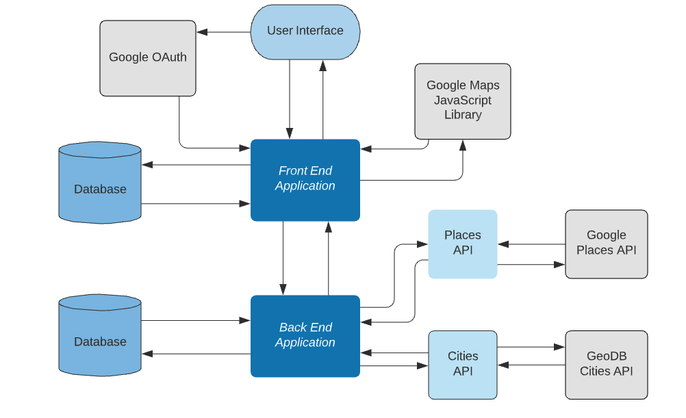

# Go Local: Cities API Microservice


## Table of Contents

-   [Description](#description)
-   [System Design](#system-design)
-   [API Contract](#api-contract)
-   [Technologies Used](#technologies-used)
-   [Local Setup](#local-setup)
-   [Learning Goals](#learning-goals)
-   [Authors](#authors)
-   [Statistics](#statistics)

## Description
Go Local allows travelers to experience their destinations like a local by inviting local users to suggest authentic travel experiences for visitors to enjoy. The app follows a Service-Oriented Architecture pattern and consists of:
  - a [front-end Rails application](https://github.com/Team-Go-Local/go_local_frontend), which provides a user interface;
  - a [back-end Rails application](https://github.com/Team-Go-Local/go_local_backend), which manages the app's database;
  - a [Sinatra Places microservice application](https://github.com/Team-Go-Local/go_local_microservice) to retrieve information from the Google Places API;
  - and a Sinatra Cities microservice application, which retrieves the nearest large city to destinations added by our users.<br>

This repository houses the Sinatra Cities microservice.

### To view the deployed application, please visit [Go Local](https://go-local-fe.herokuapp.com) on Heroku

## System Design


## API Contract

This portion of the application exposes one endpoint to be consumed by our backend application. The response adheres to the [JSON:API v1.0 specifications](https://jsonapi.org/).

- `GET /api/v1/city`: finds the nearest with a population of at least 300,000 people to a destination selected by our users, which can then be used to browse and organize search results.<br>

  - required parameters: `coordinates` (latitude/longitude in ISO-6709 format: ±DD.DDDD±DDD.DDDD)
  - example query: http://go-local-cities-api.herokuapp.com/api/v1/city?coordinates=39.7526184-105.0249216
  - example response:
  ```
  {
      "data": {
        "id": null,
        "type": "city",
        "attributes": {
          "name": "Denver",
          "state": "CO"
        }
      }
  }
  ```

## Technologies Used
- [Wirefree Thought GeoDBCities API](https://wirefreethought.github.io/geodb-cities-api-docs)
- Ruby v. 2.5.3
- Sinatra
- Heroku
- Travis-CI
- Dependencies:
  - Faraday
  - Fast JSON API
  - Figaro

## Local Setup
To use the project in your local environment, please follow the instructions below:

1. Apply for an API key for GeoDBCities through [RapidAPI](https://rapidapi.com/wirefreethought/api/GeoDB%20Cities)
2. Clone the repository:<br>
  `git clone git@github.com:Team-Go-Local/go_local_cities_api.git`
  `cd go_local_cities_api`
3. Install gem packages
  `bundle install`
4. Install Figaro
  `figaro install`
5. Enter API Key in `config/application.yml` using the following syntax:<br>
  `CITIES_API_KEY: <your api key>`
6. To launch a local server:<br>
  `shotgun`<br>
  Once the server is running you can send requests to `localhost:9393`<br>
  ex: `http://localhost:9393/api/v1/city?coordinates=39.7526184-105.0249216`
7. To run tests and view the test coverage report:<br>
  `bundle exec rspec`  
  `open coverage/index.html`
8. To run Rubocop:
  `rubocop`


## Learning Goals

- Utilize a Service-Oriented Architecture with a front-end, a back-end, and at least one micro-service
- Consume external APIs
- Build APIs that return JSON responses
- Use an external OAuth provider to authenticate users
- Deploy a production-quality user interface
- Implement an Agile workflow, including sprint planning & reviews and use of GitHub project management & code review tools

## Authors
-   Cydnee Owens | [github](https://github.com/cowens87) \| [linkedin](https://www.linkedin.com/in/cydnee-owens-5280/)
-   Gus Cunningham | [github](https://github.com/cunninghamge) \| [linkedin](https://www.linkedin.com/in/grayson-cunningham/)
-   Isabelle Villasenor | [github](https://github.com/isabellevillasenor) \| [linkedin](https://www.linkedin.com/in/isabelle-villasenor/)
-   Saundra Catalina | [github](https://github.com/saundracatalina) \| [linkedin](https://www.linkedin.com/in/saundra-catalina/)
-   Sam Yeo | [github](https://github.com/SK-Sam) \| [linkedin](https://www.linkedin.com/in/samuel-horishin-yeo/)
-   V Arruda | [github](https://github.com/nessaarruda) \| [linkedin](https://www.linkedin.com/in/vanessa-alves-de-arruda/)
-   Yesi Meza | [github](https://github.com/Yesi-MC) \| [linkedin](https://www.linkedin.com/in/yesimeza/)

## Statistics
<!-- Shields -->

